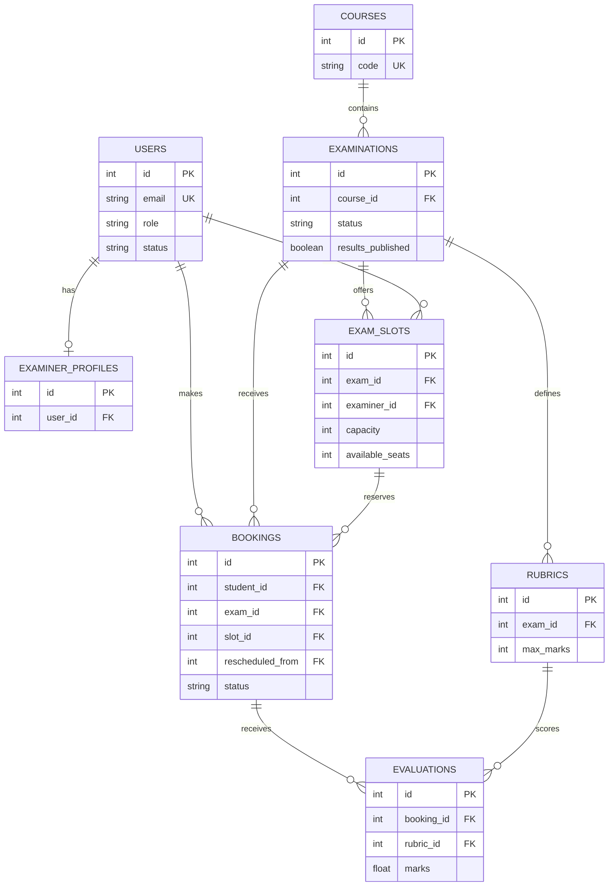

# Examination Management Portal (EMP)

Examination Management Portal (EMP) is an IITM BS Degree MAD-1 academic project for managing examination workflows. It provides separate Admin, Examiner, and Student portals for course and examination setup, slot creation and booking, evaluation against rubrics, and controlled publication of results.

## Features

### Admin

- View portal counts for courses, examinations, examiners, students, slots, and bookings.
- Create, edit, and deactivate courses.
- Create examiner accounts; approve, deactivate, and reactivate examiner registrations.
- Create and edit examinations, configure slot-creation and booking windows, and move an examination through Draft, Slot Creation, Booking Open, Booking Closed, and Completed states.
- Add, edit, and delete rubric criteria, with maximum-mark validation.
- View slots, change a slot's assigned examiner, view bookings and audit history, and reschedule active bookings.
- Browse student records, search portal records, view evaluated results, and publish results after completion checks pass.
- Update the administrator profile.

### Examiner

- View a dashboard, examinations accepting slots, and personal slots.
- Create slots during the configured slot-creation window; end time is calculated from the examination duration.
- Edit or cancel own unbooked slots before booking opens.
- View students booked into own slots.
- Evaluate students against rubric criteria, including marks and remarks.
- Update examiner name, department, and contact details.

### Student

- Register an account and update profile details.
- Browse booking-open examinations with course, type, and text filters.
- View examination details, rubrics, and available slots.
- Book a slot, view booking history, cancel an active booking before the deadline, and view an upcoming schedule.
- View completed results after an administrator publishes them.

## Tech Stack

| Technology | Use in this project |
| --- | --- |
| Python 3.12.3 | Application runtime declared in `runtime.txt`. |
| Flask | Web application framework and route handling. |
| Jinja2 | Server-rendered HTML templates. |
| HTML | Page structure and forms. |
| CSS | Custom responsive styling in `static/css/custom.css`. |
| Bootstrap | Layout, components, and icons loaded by `templates/base.html`. |
| SQLite | Default relational database. |

### Python dependencies

| Package | Purpose |
| --- | --- |
| `blinker` | Signal support used by Flask's dependency stack. |
| `click` | Command-line support used by Flask's dependency stack. |
| `Flask` | Web framework. |
| `Flask-Login` | Login sessions and `current_user` support. |
| `Flask-SQLAlchemy` | Flask integration for SQLAlchemy models and sessions. |
| `Flask-WTF` | CSRF protection integration for forms. |
| `gunicorn` | WSGI HTTP server package included in the dependency list. |
| `itsdangerous` | Signed session-data support used by Flask. |
| `Jinja2` | HTML template engine. |
| `MarkupSafe` | Safe HTML escaping used by Jinja2. |
| `python-dotenv` | Loads local variables from `.env`. |
| `SQLAlchemy` | ORM and database toolkit. |
| `typing_extensions` | Backported typing helpers required by dependencies. |
| `Werkzeug` | Request utilities and password-hashing helpers. |
| `WTForms` | Form and validation support used by Flask-WTF. |

JavaScript is not used for core logic. The included scripts support Bootstrap and interface behavior; validation, authorization, booking lifecycle changes, and persistence run on the server in Python.

## Setup and Run

1. Install Python `3.12.3`, the version declared in `runtime.txt`.

2. Create and activate a virtual environment.

   Linux/macOS:

   ```bash
   python3.12 -m venv .venv
   source .venv/bin/activate
   ```

   Windows (Command Prompt):

   ```bat
   py -3.12 -m venv .venv
   .venv\Scripts\activate
   ```

3. Install the project dependencies.

   ```bash
   pip install -r requirements.txt
   ```

4. Copy the environment template and set local values.

   Linux/macOS:

   ```bash
   cp .env.example .env
   ```

   Windows (Command Prompt):

   ```bat
   copy .env.example .env
   ```

   | Variable | Purpose | Default in code/template |
   | --- | --- | --- |
   | `FLASK_APP` | Flask application entry module. | `app.py` |
   | `FLASK_ENV` | Environment label in the supplied template. | `development` |
   | `FLASK_DEBUG` | Enables Flask debug mode when set to `1`, `true`, or `True`. | Code default: `0`; template: `1` |
   | `SECRET_KEY` | Signs session cookies and CSRF tokens. Set this to a private random value locally. | Code default: `dev-secret-key-change-later`; template placeholder: `replace-with-a-secure-random-secret-key` |
   | `DATABASE_URL` | SQLAlchemy database connection URI. | `sqlite:///emp.db` |

5. Start the application once to create the database. In `app.py`, `create_app()` enters an application context and calls `db.create_all()` from Flask-SQLAlchemy. With the default SQLite URI, Flask stores the database at `instance/emp.db`.

6. The same first application start calls `seed_admin()` in `seed.py`, which creates the initial administrator only when no admin user exists. To manage administrators manually, use `manage_admin.py`:

   ```bash
   python manage_admin.py list
   python manage_admin.py add "Name" email@example.com "Password"
   python manage_admin.py reset-password email@example.com "NewPassword"
   ```

7. Start the local application.

   ```bash
   python app.py
   ```

   Open http://127.0.0.1:5000.

8. Run the tests.

   ```bash
   python -m unittest discover -s tests
   ```

### Troubleshooting

- **`ModuleNotFoundError` or `flask` is unavailable:** activate `.venv` and run `pip install -r requirements.txt` again.
- **Port 5000 is already in use:** stop the process using the port, then run `python app.py` again.
- **Reset the local database:** stop the app, delete `instance/emp.db`, then run `python app.py`; `db.create_all()` recreates tables and `seed_admin()` recreates the initial administrator.

  Linux/macOS:

  ```bash
  rm -f instance/emp.db
  ```

  Windows (Command Prompt):

  ```bat
  del instance\emp.db
  ```

## Default Accounts

| Role | Seeded email | Source |
| --- | --- | --- |
| Admin | `admin@emp.local` | Created by `seed.py` through `seed_admin()`. |
| Examiner | No demo examiner account is seeded. | Create one through examiner registration or the admin interface. |
| Student | No demo student account is seeded. | Register through the student registration page. |

Passwords are set in `seed.py` for the seeded administrator and supplied through `manage_admin.py` when using its add or reset commands. They are intentionally not documented here.

## Project Structure

`instance/` is created by Flask as needed and holds the default SQLite database (`instance/emp.db`). Database files are intentionally excluded below.

```text
.
├── .env
├── .env.example
├── .gitignore
├── app.py
├── config.py
├── decorators.py
├── extensions.py
├── manage_admin.py
├── models.py
├── requirements.txt
├── runtime.txt
├── seed.py
├── services.py
├── utils.py
├── blueprints/
│   ├── __init__.py
│   ├── admin.py
│   ├── api.py
│   ├── auth.py
│   ├── examiner.py
│   └── student.py
├── static/
│   ├── css/
│   │   └── custom.css
│   └── images/
│       └── emp-logo.png
├── templates/
│   ├── 403.html
│   ├── 404.html
│   ├── 500.html
│   ├── base.html
│   ├── admin/
│   │   ├── bookings.html
│   │   ├── courses.html
│   │   ├── dashboard.html
│   │   ├── exam_detail.html
│   │   ├── examiners.html
│   │   ├── examiners_add.html
│   │   ├── exams.html
│   │   ├── profile.html
│   │   ├── results.html
│   │   ├── search.html
│   │   ├── slots.html
│   │   └── students.html
│   ├── auth/
│   │   ├── login.html
│   │   ├── register_examiner.html
│   │   └── register_student.html
│   ├── examiner/
│   │   ├── create_slot.html
│   │   ├── dashboard.html
│   │   ├── evaluate.html
│   │   ├── exams.html
│   │   ├── profile.html
│   │   ├── slots.html
│   │   └── students.html
│   └── student/
│       ├── bookings.html
│       ├── dashboard.html
│       ├── exam_detail.html
│       ├── exams.html
│       ├── profile.html
│       ├── results.html
│       └── schedule.html
└── tests/
    └── test_emp_workflows.py
```

### Root files

| Path | Contents |
| --- | --- |
| `.env` | Local environment configuration copied from the template; it is ignored by Git and may contain secrets. |
| `.env.example` | Documented local environment-variable template. |
| `.gitignore` | Ignore rules for secrets, virtual environments, databases, caches, editor files, and temporary files. |
| `app.py` | Flask application factory, extension and blueprint registration, table creation, admin seeding, error handlers, and local entry point. |
| `config.py` | Configuration class for environment loading, SQLite URI, session settings, CSRF, and debug mode. |
| `decorators.py` | `role_required` decorator for active, role-based access control. |
| `extensions.py` | Shared `SQLAlchemy` and `LoginManager` instances. |
| `manage_admin.py` | Command-line tools to list admins, add an admin, and reset an admin password. |
| `models.py` | All database tables, constraints, and ORM relationships. |
| `requirements.txt` | Pinned Python dependencies. |
| `runtime.txt` | Declares Python `3.12.3`. |
| `seed.py` | Idempotent seed function for the initial administrator. |
| `services.py` | Booking lifecycle transactions, slot-seat operations, conflict checks, and evaluation-completeness helpers. |
| `utils.py` | Slot-creation and booking window checks plus evaluation-completeness helper. |

### Blueprints

| File | URL prefix and main routes |
| --- | --- |
| `blueprints/__init__.py` | Package marker; contains no routes. |
| `blueprints/auth.py` | No prefix: `/`, `/login`, `/logout`, `/register/student`, and `/register/examiner`. |
| `blueprints/admin.py` | `/admin`: dashboard; course, examiner, examination, rubric, slot, booking, student, search, results, and profile management routes. Main examination lifecycle routes are `/exams/<exam_id>/open-slots`, `/open-booking`, `/close-booking`, `/complete`, and `/publish-results`; booking rescheduling is `/bookings/<booking_id>/reschedule`. |
| `blueprints/examiner.py` | `/examiner`: `/dashboard`, `/exams`, `/slots`, `/slots/create`, slot edit/cancel/student routes, `/evaluate/<booking_id>`, and `/profile`. |
| `blueprints/student.py` | `/student`: `/dashboard`, `/exams`, `/exams/<exam_id>`, `/book/<slot_id>`, `/cancel/<booking_id>`, `/bookings`, `/schedule`, `/results`, and `/profile`. |
| `blueprints/api.py` | `/api`: `/stats`, `/examinations`, `/examinations/<exam_id>`, `/students`, and `/bookings`. |

### Templates

| Path | Contents |
| --- | --- |
| `templates/base.html` | Shared layout, navigation, flash messages, Bootstrap assets, and UI scripts. |
| `templates/403.html` | Access-denied page. |
| `templates/404.html` | Not-found page. |
| `templates/500.html` | Server-error page. |
| `templates/auth/login.html` | Login form. |
| `templates/auth/register_student.html` | Student registration form. |
| `templates/auth/register_examiner.html` | Examiner registration form. |
| `templates/admin/dashboard.html` | Administrator dashboard. |
| `templates/admin/courses.html` | Course management page. |
| `templates/admin/exams.html` | Examination list and creation page. |
| `templates/admin/exam_detail.html` | Examination settings, lifecycle, rubrics, and related detail page. |
| `templates/admin/examiners.html` | Examiner management and approval page. |
| `templates/admin/examiners_add.html` | Administrator-created examiner form. |
| `templates/admin/slots.html` | Portal-wide slot list and examiner reassignment controls. |
| `templates/admin/bookings.html` | Booking list, audit history, and rescheduling controls. |
| `templates/admin/students.html` | Student directory. |
| `templates/admin/search.html` | Unified portal search page. |
| `templates/admin/results.html` | Completed examination results and scoring history. |
| `templates/admin/profile.html` | Administrator profile page. |
| `templates/examiner/dashboard.html` | Examiner dashboard. |
| `templates/examiner/exams.html` | Examinations currently accepting slots. |
| `templates/examiner/create_slot.html` | Slot creation form. |
| `templates/examiner/slots.html` | Examiner's slot list with edit and cancellation controls. |
| `templates/examiner/students.html` | Booked students for an examiner-owned slot. |
| `templates/examiner/evaluate.html` | Rubric-based student evaluation form. |
| `templates/examiner/profile.html` | Examiner profile page. |
| `templates/student/dashboard.html` | Student dashboard. |
| `templates/student/exams.html` | Browse and filter available examinations. |
| `templates/student/exam_detail.html` | Examination details, rubric, and available-slot page. |
| `templates/student/bookings.html` | Booking history and cancellation page. |
| `templates/student/schedule.html` | Active booking schedule. |
| `templates/student/results.html` | Published-result page. |
| `templates/student/profile.html` | Student profile page. |

### Static files and tests

| Path | Contents |
| --- | --- |
| `static/css/custom.css` | EMP visual design and responsive layout styles. |
| `static/images/emp-logo.png` | Portal logo used as the site icon and in the interface. |
| `tests/test_emp_workflows.py` | `unittest` coverage for slot visibility, booking, conflicts, cancellation, rescheduling, lifecycle locking, evaluation, completion, and publishing. |

## Database Design

| Table | Main columns | Foreign keys |
| --- | --- | --- |
| `users` | `id`, `name`, `email` (unique), `password`, `role`, `status`, `created_at`, `phone`, `roll_no` | None |
| `examiner_profiles` | `id`, `user_id` (unique), `department`, `contact` | `user_id` -> `users.id` |
| `courses` | `id`, `code` (unique), `name`, `description`, `status`, `created_at` | None |
| `examinations` | `id`, `course_id`, `name`, `type`, `duration`, `max_marks`, slot-creation and booking timestamps, `status`, `results_published`, `created_at` | `course_id` -> `courses.id` |
| `rubrics` | `id`, `exam_id`, `criterion_name`, `max_marks`, `weightage`, `description` | `exam_id` -> `examinations.id` |
| `exam_slots` | `id`, `exam_id`, `examiner_id`, `exam_date`, `start_time`, `end_time`, `capacity`, `available_seats`, `status` | `exam_id` -> `examinations.id`; `examiner_id` -> `users.id` |
| `bookings` | `id`, `student_id`, `exam_id`, `slot_id`, `booking_date`, `status`, `cancelled_at`, `rescheduled_from`, `rescheduled_at` | `student_id` -> `users.id`; `exam_id` -> `examinations.id`; `slot_id` and `rescheduled_from` -> `exam_slots.id` |
| `evaluations` | `id`, `booking_id`, `rubric_id`, `marks`, `remarks`, `evaluated_at` | `booking_id` -> `bookings.id`; `rubric_id` -> `rubrics.id` |

One course has many examinations. Each examination has rubrics, slots, and bookings. An examiner has one optional profile and can own many slots. A student can have many bookings. A booking belongs to one examination and slot, and has one evaluation per rubric; the `(booking_id, rubric_id)` pair is unique. Active bookings are also uniquely constrained per `(student_id, exam_id)` when their status is `Booked`.



## Business Rules Implemented

| Rule | Implementation |
| --- | --- |
| Slot-creation window | `utils.py` checks the configured start/end timestamps; `blueprints/examiner.py` requires an eligible examination status and an open window before creating a slot. |
| Booking window | `utils.py` requires both `Booking Open` status and a current time inside the configured booking window; `blueprints/student.py` checks it again when booking and cancelling. |
| Overbooking prevention | `services.py` reserves a seat only when a slot is available with seats remaining; booking lifecycle writes use an immediate SQLite transaction and slot/examination locks. |
| Full-slot status | `services.reserve_slot_seat()` changes a slot to `Full` when `available_seats` reaches zero; cancellation releases a seat and restores `Available` when appropriate. |
| Duplicate booking prevention | `student.book_slot()` checks for an existing active booking, and `models.py` adds a partial unique index for one `Booked` record per student per examination. |
| Schedule-conflict prevention | `services.find_student_time_conflict()` blocks overlapping active bookings on the same date; it is used for new bookings and admin rescheduling. |
| Cancellation and history | `student.cancel_booking()` allows cancellation only while booking is open and before the booking end time, marks the record `Cancelled`, records `cancelled_at`, and does not delete it. |
| Slot ownership and evaluation | Examiner slot edit, cancel, student-list, and evaluation routes verify that the slot belongs to the current examiner. |
| Rescheduling and examiner reassignment | `admin.reschedule_booking()` checks status, slot capacity, and student time conflicts, releases/reserves seats, and records the original slot and reschedule timestamp. `admin.change_examiner()` reassigns a slot to an examiner. |
| Completion and publication | Admin completion requires booking closure and complete evaluations. Publishing requires completion, at least one rubric, rubric marks equal to the examination maximum, and no incomplete active evaluations. |
| Read-only evaluations after publication | `examiner.evaluate()` refuses changes when `results_published` is true. |

## Authentication and Authorization

Authentication confirms who a user is; authorization decides what that authenticated user may access. `blueprints/auth.py` validates the password hash, starts a Flask-Login session with `login_user()`, and routes users to their role dashboard. `app.py` configures Flask-Login and supplies the user loader.

Protected portal routes use `@login_required` together with `@role_required(...)` from `decorators.py`. The role decorator rejects unauthenticated requests with `401`, rejects an unauthorized role with `403`, and requires `status == "active"`.

Student registration creates an active student account. Examiner self-registration creates a `pending` account and an `ExaminerProfile`; pending examiners cannot log in until an administrator approves them. Inactive users also cannot log in, and active-session access is denied by the role decorator.

## API Endpoints

All API routes require login.

| Endpoint | Access | Response |
| --- | --- | --- |
| `GET /api/stats` | Any authenticated user | Counts for courses, examinations, examiners, students, and bookings. |
| `GET /api/examinations` | Any authenticated user | Examination list and statuses. |
| `GET /api/examinations/<exam_id>` | Any authenticated user | Examination details and rubrics. |
| `GET /api/students` | Admin only | Student directory records. |
| `GET /api/bookings` | Any authenticated user | All bookings for admins, own-slot bookings for examiners, or own bookings for students. |

## Environment Variables

| Name | Purpose | Default |
| --- | --- | --- |
| `FLASK_APP` | Flask CLI application module. | `app.py` in `.env.example` |
| `FLASK_ENV` | Environment label in `.env.example`. | `development` |
| `FLASK_DEBUG` | Enables debug mode for `1`, `true`, or `True`. | `0` in code; `1` in `.env.example` |
| `SECRET_KEY` | Signs sessions and CSRF tokens. | `dev-secret-key-change-later` in code |
| `DATABASE_URL` | SQLAlchemy connection URI. | `sqlite:///emp.db` |

## Notes and Limitations

- The default secret key is suitable only for local development. Set a private `SECRET_KEY` in `.env`.

## License

This is an academic project submitted for IITM BS Degree MAD-1. All rights reserved. Not for redistribution.
# EXAMINATION-MANAGEMENT-PORTAL
